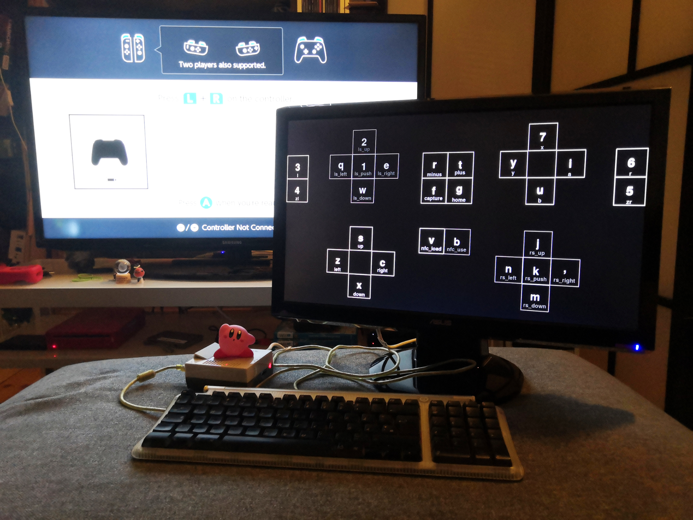

# 😂

graphical Switch controller emulation



tearsofjoy is a pygame GUI for [joycontrol](https://github.com/mart1nro/joycontrol). it was built for Raspberry Pi but should work with little effort wherever joycontrol does.

features:

- keyboard control: PC keyboard mappings to all Pro controller buttons (analog sticks not supported yet!)
- NFC tag browser: convenient search and selection of NFC tag .bin files

## installation

install joycontrol according to [their instructions](https://github.com/mart1nro/joycontrol).

clone the tearsofjoy repository:

```
git clone https://github.com/ahihi/tearsofjoy.git
```

enter the cloned directory:

```
cd tearsofjoy
```

create a directory for NFC tags:

```
mkdir -p nfc
```

put any NFC tag .bin files you intend to use in the directory.

run the script:

```
sudo python3 tearsofjoy.py
```

on the Switch, open the "Change Grip/Order" menu.

## usage

the main controller screen shows the buttons and their keyboard mappings. the buttons are greyed out until a successful connection to the Switch is made. to exit, press `esc`.

to open the NFC tag browser, press the key mapped to `nfc_load`. in the browser, scroll through files using the `up`/`down` arrow keys. you can also type to filter the available files. select a file by pressing `enter`.